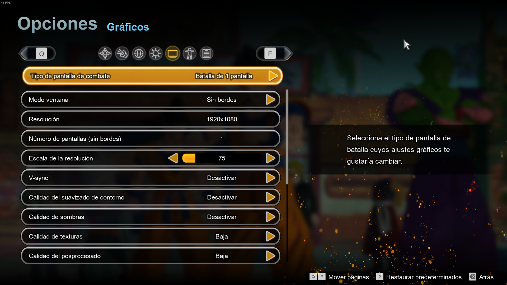
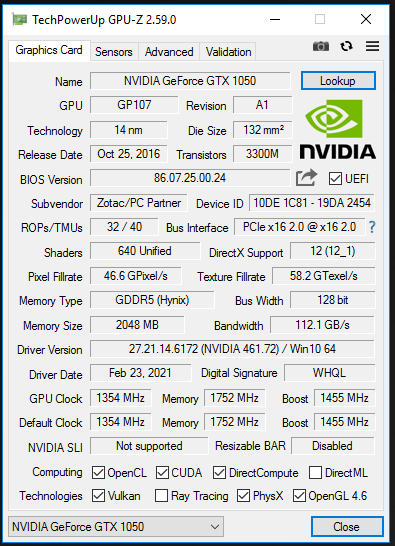
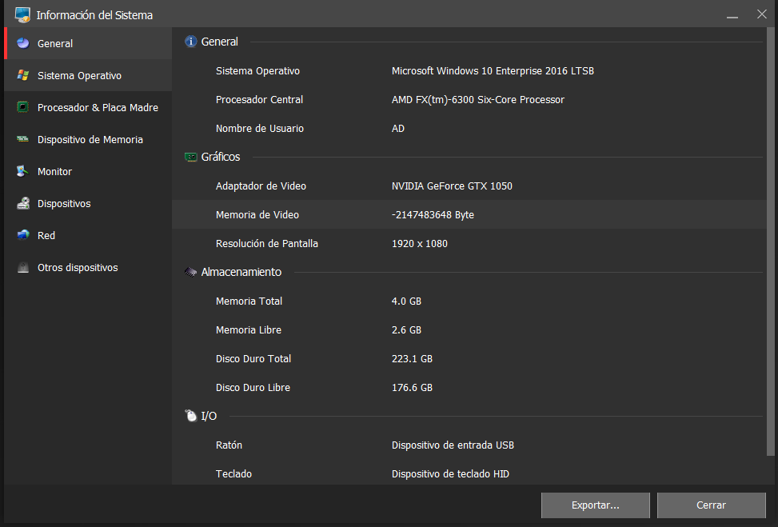
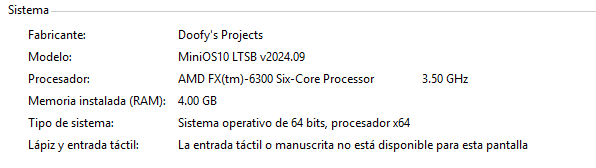
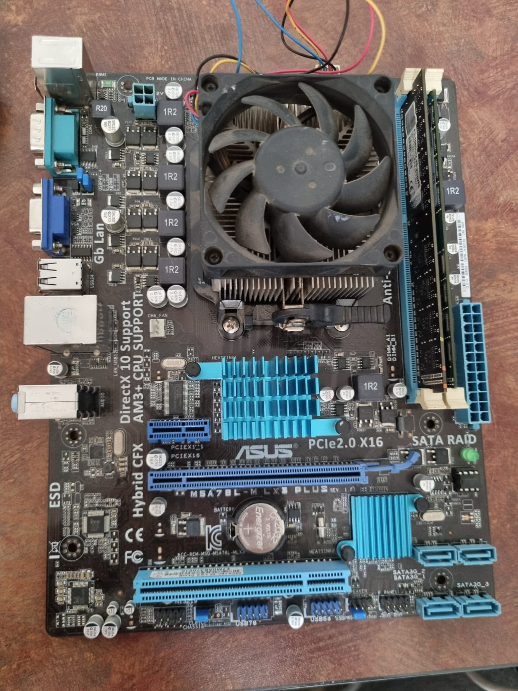
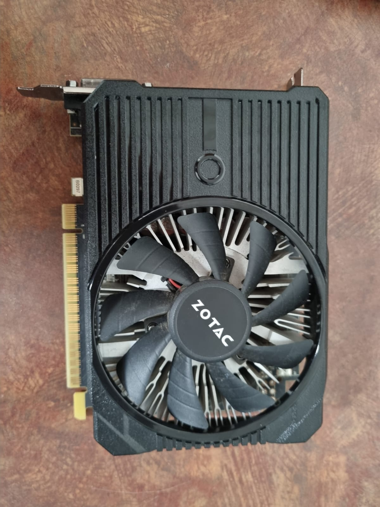
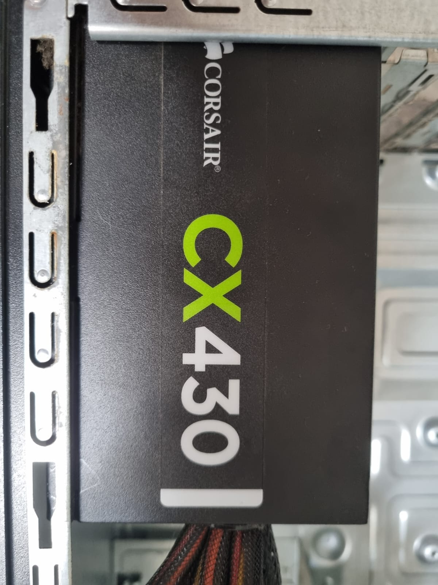
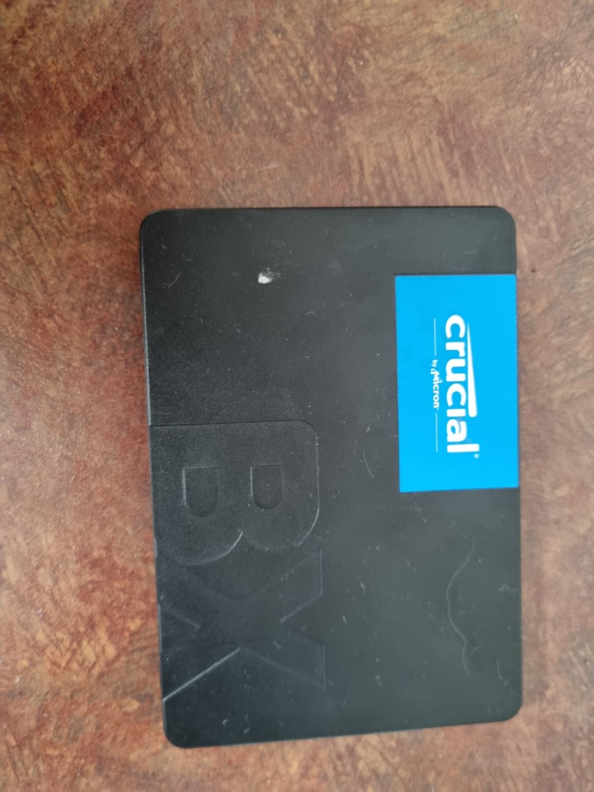

# Proyecto: Dragon Ball Sparking Zero en un PC Económico

Este proyecto demuestra cómo jugar el nuevo **Dragon Ball Sparking Zero** en un PC de bajo costo con especificaciones mínimas. Incluye detalles sobre la configuración del sistema, ajustes gráficos, y el rendimiento del juego.

## Especificaciones del PC y Costos

| Componente               | Precio (CLP) | Precio (USD) |
|--------------------------|--------------|--------------|
| Procesador FX 6300       | $5,000       | $5.56        |
| Memoria RAM 4 GB         | $5,000       | $5.56        |
| Fuente Corsair           | $15,000      | $16.67       |
| SSD 250 GB               | $15,000      | $16.67       |
| Tarjeta Gráfica GTX 1050 | $40,000      | $44.44       |
| Gabinete Genérico        | $0           | $0.00        |
| Placa Madre AM3+         | $10,000      | $11.11       |
| **Total**                | **$90,000**  | **$100.00**  |

**Nota:** También se recomienda utilizar un **procesador Intel i5 de 2da o 3ra generación** con una **placa madre socket 1155**, ya que ofrecería un rendimiento similar al FX 6300 en este tipo de configuración económica.
> Los precios están en pesos chilenos (CLP) y se ha utilizado un tipo de cambio aproximado de 1 USD = 900 CLP.

## Configuración del Juego

- **Resolución:** 1920x1080
- **Escala de la Resolución:** 75%
- **Modo de Ventana:** Sin bordes
- **V-Sync:** Desactivado
- **Calidad de Sombras, Texturas y Suavizado de Contorno:** Baja
- **Calidad del Posprocesado:** Baja

Se utilizó un **mod de estabilización de FPS** para mejorar el rendimiento. Puedes descargar el mod desde el siguiente enlace: [Mod de estabilización de FPS](https://www.nexusmods.com/dragonballsparkingzero/mods/1).

## Rendimiento

En esta configuración, el juego logra un promedio de 60 FPS. Se realizaron ajustes para optimizar el rendimiento y evitar caídas de FPS.

## Instalación y Ajustes

1. **Instalar MiniOS Windows 10 LTSB** para maximizar el uso de recursos en sistemas con poca RAM. Puedes descargar MiniOS desde [aquí](https://www.dprojects.org/minios).
2. **Configurar el juego** con los ajustes gráficos indicados arriba.
3. **Utilizar el mod de estabilización de FPS** (enlace arriba).
4. **Actualizar los controladores de la tarjeta gráfica** a la última versión compatible (NVIDIA 461.72).

## Imágenes del Proyecto

### Capturas de Pantalla del Juego y Configuración

1. **Configuración del Juego**  
   

2. **Información del GPU**  
   

3. **Información del PC**  
   

4. **Juego en acción**  
   

5. **Sistema Operativo**  
   

### Imágenes de los Componentes

Aquí se incluyen imágenes reales de los componentes utilizados en este proyecto:

1. **Memoria RAM 4 GB - Placa Madre AM3+ - Procesador FX 6300**  
   

2. **Tarjeta Gráfica GTX 1050**  
   

3. **Fuente Corsair**  
   

4. **SSD 250 GB**  
   

## Conclusión

Este proyecto demuestra que es posible jugar **Dragon Ball Sparking Zero** en un PC económico con una experiencia aceptable si se aplican los ajustes correctos. Es una opción viable para aquellos con un presupuesto limitado.
